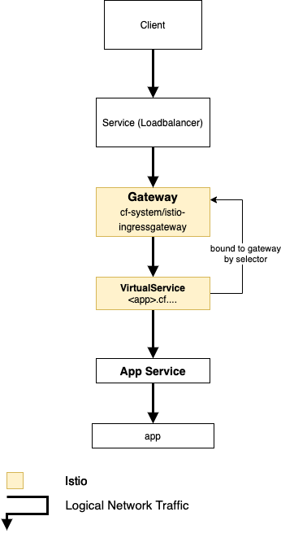
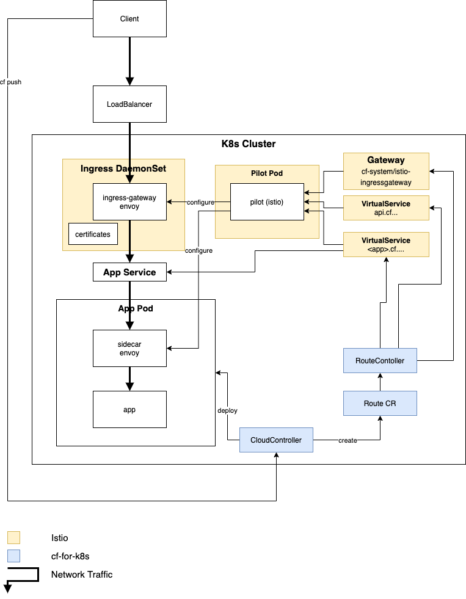
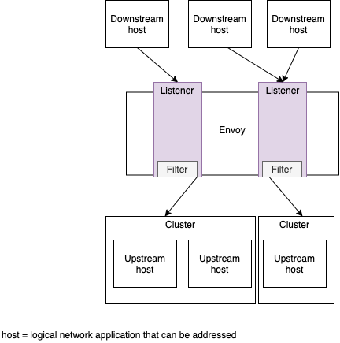

# CF for K8s networking

## Logical Network Traffic

| Artefact                                                                                                            | Description                                                                     |
|---------------------------------------------------------------------------------------------------------------------|---------------------------------------------------------------------------------|
| Client                                                                                                              | A client which would like to talk to the application                            |
| [Service(LoadBalancer)](https://kubernetes.io/docs/tasks/access-application-cluster/create-external-load-balancer/) |  External Load Balancer                                                                         |
| [Gateway](https://istio.io/docs/reference/config/networking/gateway/)                                               |                                                                                 |
| [Virtual Service](https://istio.io/docs/reference/config/networking/virtual-service/)                               | How you route your traffic to a given destination. Refers to kubernetes service |
| [App Service](https://kubernetes.io/docs/concepts/services-networking/service/)                                     | Kubernetes service, which is used to route the traffic to the application pod   |
| app                                                                                                                 | The application itself                                                          |

## Physical Network Traffic

### Client

The client wants to use an application, which is running inside Cloud Foundry. The application is accessed using HTTP or HTTPs.

### Developer

The developer deploys the application to Cloud Foundry using `cf push`. During this action the Cloud controller builds the application and deploys it to kubernetes. Additionally the Cloud Controller creates a `Route CR`.

### [Service(LoadBalancer)](https://kubernetes.io/docs/tasks/access-application-cluster/create-external-load-balancer/) 
Exposes the Service externally using a cloud provider’s load balancer. An example configuration can be found [here](examples/service-istio-ingressgateway.yaml).

### [IngressGateway](https://istio.io/docs/reference/config/networking/gateway/)

The `IngressGateway`, is responsible to route the network traffic to different locations like system services of applications. Istio is using [Envoy](https://www.envoyproxy.io/) for this purpose. Envoy is configured by Pilot(see below). In cf-for-k8s, only `VirtualServices` are used to configure the routes. For details see Routes below.

The `IngressGateway` is implemented as [`DaemonSet`](https://istio.io/docs/reference/config/networking/gateway/). A `DaemonSet` ensures that all Nodes run a copy of this gateway.

An example configuration can be found [here](examples/istio-ingressgateway.yaml)

### [Pilot](https://istio.io/docs/ops/deployment/architecture/#pilot)

Pilot converts high level routing rules (e.g. `Gateways` or `VirtualServices`) that control traffic behavior into Envoy-specific configurations, and propagates them to the sidecars at runtime. 

### App Service

An example configuration can be found [here](examples/app-service.yaml)

### Application

This is the application, which is deployed by the developer and used by the client. The inbound traffic is routed through the Envoy, which is running in a sidecar.

#### [Sidecar](https://istio.io/docs/reference/config/networking/sidecar/)
Every instance(replica) of an app has a sidecar Envoy, which runs in parallel with the app. These Envoys monitors everything about the application.

### [Cloud Controller](https://docs.cloudfoundry.org/concepts/architecture/cloud-controller.html)

The Cloud Controller in Cloud Foundry (CF) provides REST API endpoints for clients (developers) to access the system.

### RouteController && Route CR [WIP]
The Architecture Decision to use `Route CRD` and `RouteController` can be found [here](https://github.com/cloudfoundry/cf-k8s-networking/blob/master/doc/architecture-decisions/0010-route-crd-and-kubebuilder-instead-of-metacontroller.md).
According to the [CF4k8s Networking - Route CRD Proposal](https://docs.google.com/document/d/1DF7eTBut1I74w_sVaQ4eeF74iQes1nG3iUv7iJ7E35U/) RouteController watches for updates to the `Route CR` and translates these into `Kubernetes Service` and `Istio VirtualService` objects.

### Routes

#### [Gateway](https://istio.io/docs/reference/config/networking/gateway/)

Cloud Foundry uses one single `Gateway` to route the network traffic.

#### [Virtual Service for System Services](https://istio.io/docs/reference/config/networking/virtual-service/)

During installation a `VirtualService` is created for each system service:
* Cloud Controller `api.cf...`
* Log Cache `log-cache.cf...`
* UAA `uaa.cf...`, `*.uaa.cf...`, `login.cf...`, `*.login.cf...`

#### [Virtual Service for Applications](https://istio.io/docs/reference/config/networking/virtual-service/)

For each application a `VirtualService` is created. An example configuration can be found [here](examples/app-virtualservice.yaml)

This `VirtualService` is also responsible to add the required HTTP headers (e.g. `CF-App-Id`).

Each `VirtualService` refers to a kubernetes service. [`DestinationRules`](https://istio.io/docs/concepts/traffic-management/#destination-rules) are also part of Istio traffic management. Using destination rules you can configure what happens to traffic for that destination (e.g. traffic policy).

*NOTE:* Envoy first evaluates route rules in virtual services to determine if a particular subset is being routed to. If so, only then will it activate any destination rule policies corresponding to the subset. Consequently, Istio only applies the policies you define for specific subsets in destination rules if you explicitly routed traffic to the corresponding subset.

## Envoy

- The envoyproxy documentation contains a subpage where the basic terminology (listener, upstream, downstream, cluster, ...) of envoy is explained: https://www.envoyproxy.io/docs/envoy/latest/intro/arch_overview/intro/terminology

*Note*: In the istio case other envoy proxy runs on the same node (as sidecar container) as the app on the upstream host.

Envoy Ingress [config](examples/initial/ingress.json) contains:
- clusters
  - static clusters (for statistics e.g. prometheus)
  - cluster
    - service_name
    - circuit breaking (Envoy enforces these limits at network level) 
    - transport_socket (for tls context)
- listeners
- routes 
- secrets

- The istio documentation has some information on how-to retrieve the current configuration of the sidecar and ingress envoys in a cluster using the `istioctl` https://istio.io/docs/ops/diagnostic-tools/proxy-cmd/

## Open topics

* Looking at what the Envoy's (sidecar and gateway) configuration looks like

### Debugging

* Looking into the TCP layer?
* Looking at k8s networking (in particular when traffic gets routed to another worker node?
* Looking at the traffic passing through Envoys

### Open Questions

* Istio `istio-system/ingressgateway` is not used.
